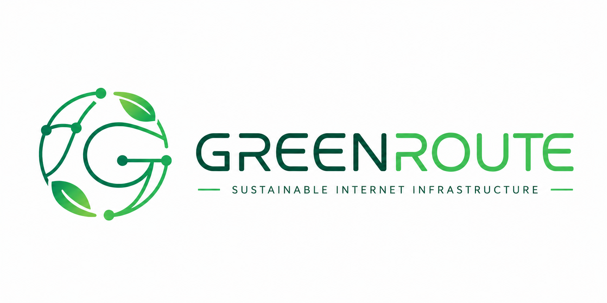
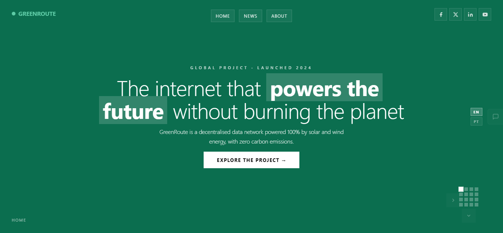
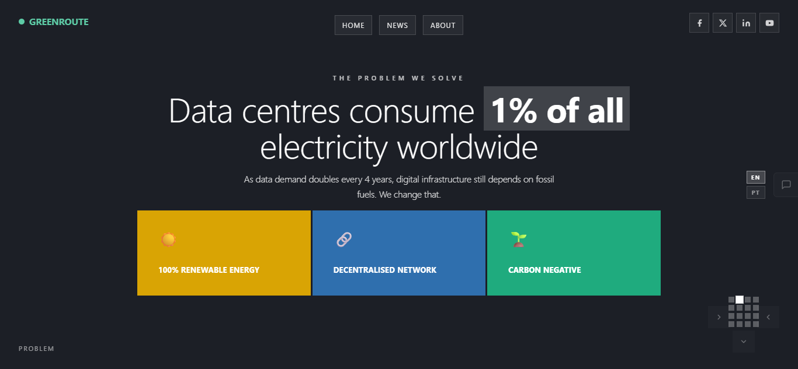
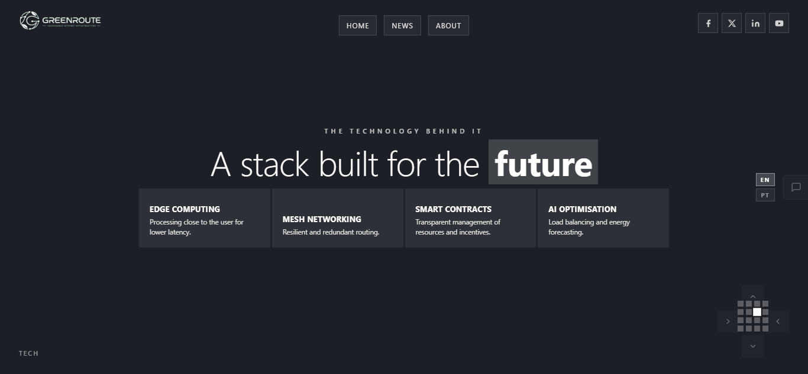
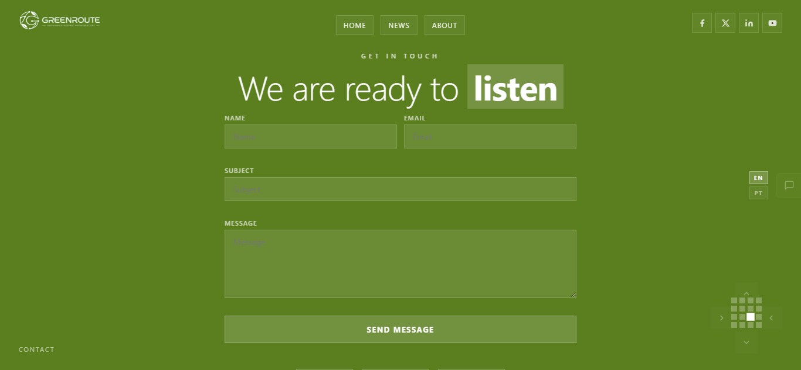
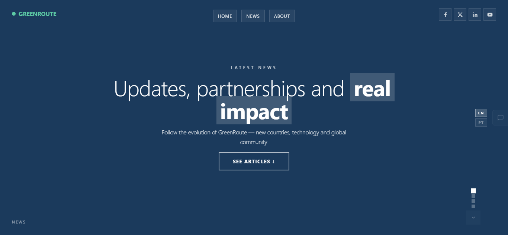

# GreenRoute



Fullscreen canvas-based website template for sustainable internet infrastructure brands.

> The GreenRoute logo was designed by [Eduardo Costa Nkuansambu](https://github.com/ecnmee).



---

## Preview

| | |
|---|---|
|  |  |
|  |  |



---

## File structure

```
/
├── index.html              Main page (2D canvas grid)
├── about.html              About page (vertical canvas)
├── news.html               News listing (vertical canvas)
├── post.html               Single article (vertical canvas)
├── robots.txt
├── sitemap.xml
├── .htaccess
├── README.md
├── COMPONENTS.md
├── CONTRIBUTING.md
├── assets/
│   ├── css/
│   │   └── main.css        Global styles + responsive
│   ├── img/
│   │   └── preview/        README screenshots
│   └── js/
│       ├── main.js         2D canvas engine (index)
│       ├── canvas-vertical.js  Vertical canvas engine (subpages)
│       ├── nav-mobile.js   Hamburger + drawer for mobile
│       └── i18n.js         EN/PT language switcher
└── docs/
    ├── canvas-engine.md
    ├── nav-mobile.md
    ├── css-tokens.md
    └── adding-pages.md
```

## Run locally

Any static server works. Examples:

```bash
# Python
python3 -m http.server 8080

# Node (npx)
npx serve .

# VS Code
# Install the "Live Server" extension and click "Go Live"
```

Open `http://localhost:8080` in your browser.

## Navigation

| Device | Action |
|---|---|
| Desktop | Scroll, arrow keys ↑↓←→, on-screen buttons |
| Touch desktop | Swipe vertical / horizontal |
| Mobile | Swipe vertical, hamburger menu |

## Language

The template ships with bilingual support out of the box. Default language is **English**. The switcher persists the user's choice via `localStorage`.

To add a new language, see `assets/js/i18n.js` and add `data-{lang}` attributes to translatable elements.

## Dependencies

None. Pure HTML + CSS + vanilla JavaScript.

## Logo

Two versions are included in `assets/img/`:

| File | Use case |
|---|---|
| `logo.png` | Transparent background — used across all site pages (dark panels) |
| `logo_green.png` | Light background — used in this README and any light-theme context |

Logo design © [Eduardo Costa Nkuansambu](https://github.com/ecnmee).

## License

Commercial use permitted. Customise freely for client projects or resale.
